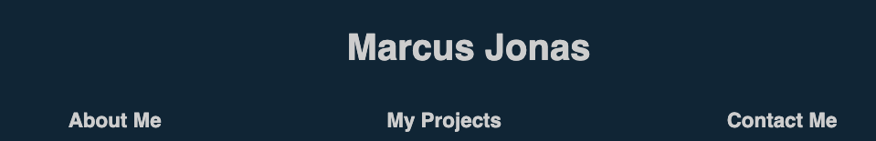
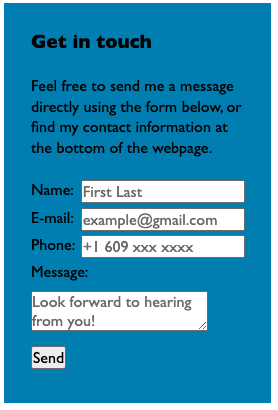

# AboutMe

## Description

Welcome to the repository for my personal portfolio website. The repository contains the html file, css stylesheets containing css code for resetting default browser styles, styling my website and holding some of the variables used throughout the sheet, images, as well as this README. In the website you will find three main sections: About Me, My Projects and Contact Me. In the About Me section I give introduce myself and give the reader a bit of my background. I also list some hobbies and a fun fact. In the My Projects section I list the projects I have worked on and completed so far, the two main being Horiseon and this portfolio website. In the Contact Me section in the footer I list my phone, email and GitHub username, There is also a form on the page that the user can use to get in contact. 

Hope you enjoy the page! 

## Usage

The use of the webpage is very simple. The links in the navigation bar can be clicked, and upon clicking will scroll the UI to the corresponding section for ease of moving around the webpage. The images in the My Projects section can also be clicked and will take you to the launched application the project refers to. As you will find, clicking Project 2 will bring you back to the webpage you are currently on, as this is the application the project refers to. Project 3 hasn't yet been started, but will be added as it is completed. 

Screenshot of clickable navigation bar: 

Screenshot of clickable images in the My Projects section: 

The form on the right hand side of the page can be used. Note the message that displays upon pressing Send! my contact information is also listed at the bottom of the page if easier for the user, with the last two links to email and GitHub profile. 

Screenshot of form:  

## Credits

This webpage was coded from scratch by me, with help from class slides and one or two lines from the internet. 

The class **textOverlap** in style.css was borrowed from: https://stackoverflow.com/questions/40534083/css-block-on-top-of-image
Code line 97 in the index.html was borrowed from: https://www.w3schools.com/html/html_form_input_types.asp

## License

N/A
